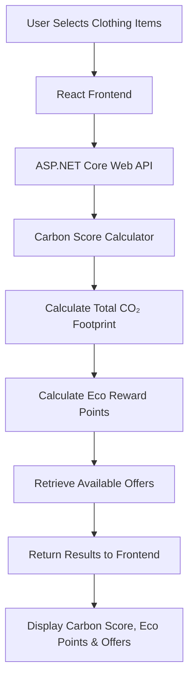

# 🌍 EcoScan - Clothing Carbon Footprint Scanner

## 📜 Overview
EcoScan is a web application designed to help users understand the environmental impact of their clothing purchases. Users can select one or more clothing items, view their estimated carbon footprint, earn eco-reward points, and redeem sustainability-focused offers. This project demonstrates a full-stack solution for promoting environmentally conscious purchasing decisions.

## 🔧 Tech Stack
- **Frontend:** React (Vite)
- **Backend:** ASP.NET Core Web API (.NET 8, C#)

---

## 🌱 Carbon Score Assumptions

To calculate the environmental impact of each clothing item, approximate carbon scores are assigned based on the clothing type. These values are stored in an in-memory dictionary.

| 👕 Item | 🌍 Estimated Carbon Score (kg CO₂) |
|---------|------------------------------------:|
| T-shirt | 5 |
| Jeans | 10 |
| Jacket | 15 |
| Shoes | 8 |

---

## 🌟 Product & Technical Enhancements

1. **Scaling:** Replace the in-memory storage with a SQL Server database and deploy the backend to a cloud platform.
2. **Enhanced Eco-Score Model:** Calculate carbon scores using additional information such as clothing material, manufacturing location, and brand sustainability ratings.
3. **User Experience Improvements:** Add a leaderboard, sustainability insights, and a history of previous scans to encourage user engagement.
4. **API Integrations:** Integrate with external carbon footprint APIs to provide more accurate and up-to-date environmental data.

---

## 🏗️ Application Flow

