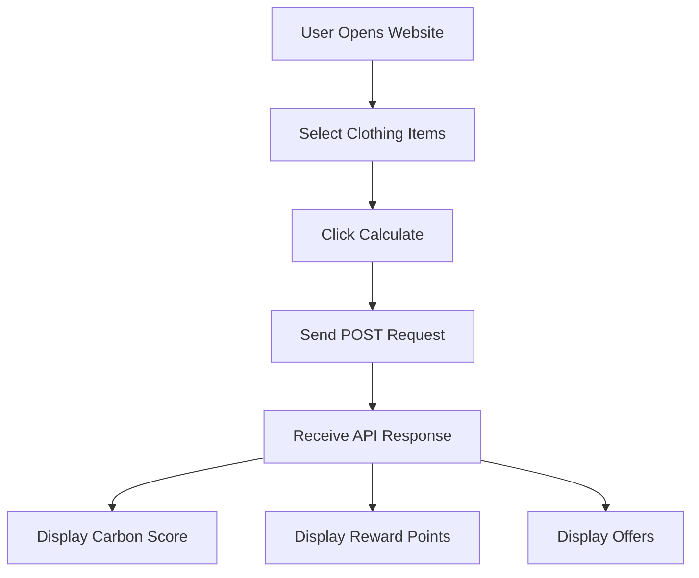
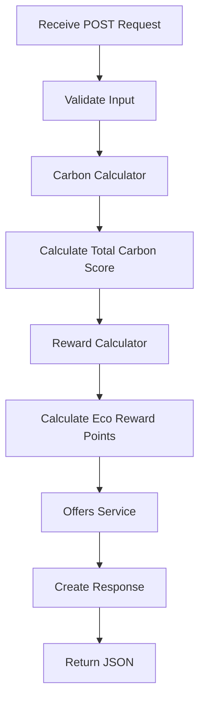
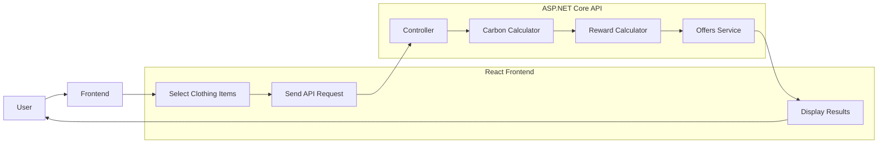
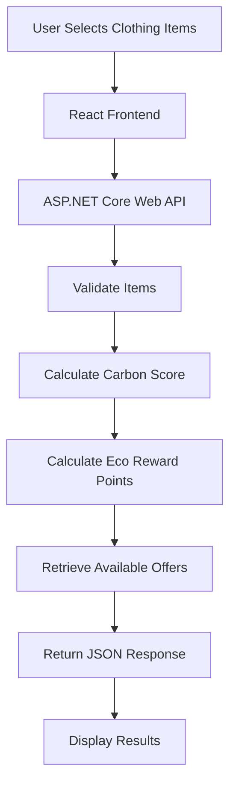

# 🌍 EcoScan - Clothing Carbon Footprint Scanner

## 📜 Overview

EcoScan is a full-stack web application that helps users understand the environmental impact of their clothing purchases.

For this implementation, users select clothing items from a predefined list instead of uploading an image. This simplifies the application while allowing the core backend functionality, API design, and business logic to be fully demonstrated. The project has been designed so image recognition can be integrated later without major architectural changes.

The application allows users to:

- Select one or more clothing items.
- Calculate the estimated carbon footprint.
- Earn Eco Reward Points.
- View sustainability offers based on earned points.

---

# 🎯 Project Objectives

- Build a clean and responsive React frontend.
- Develop a RESTful ASP.NET Core Web API.
- Calculate carbon footprint for selected clothing items.
- Award eco-reward points based on purchases.
- Display available sustainability offers.
- Demonstrate clean architecture and scalable design.

---

# 🏗️ System Architecture

```text
+----------------------+
|   React Frontend     |
+----------+-----------+
           |
           | HTTP Requests
           |
           ▼
+----------------------+
| ASP.NET Core Web API |
+----------+-----------+
           |
           |
    +------+------+----------------+
    |             |                |
    ▼             ▼                ▼
Carbon      Reward Points     Offers Service
Calculator    Calculator
```

The frontend communicates with the backend using REST APIs. Business logic is contained entirely within the backend, while the frontend focuses on user interaction and displaying results.

---

# 📐 Application Design

## Frontend

The frontend is responsible for:

- Allowing users to select clothing items.
- Sending selected items to the backend.
- Displaying:
  - Selected items
  - Individual carbon scores
  - Total carbon footprint
  - Eco reward points
  - Available offers

---

## Backend

The backend is separated into services to improve maintainability.

| Service | Responsibility |
|---------|----------------|
| Clothing Service | Validates clothing items |
| Carbon Calculator | Calculates carbon footprint |
| Reward Calculator | Calculates eco reward points |
| Offers Service | Returns available offers |

---
# 🖥️ Frontend Design

The frontend is built using **React (Vite)** and is responsible for providing a simple and intuitive user interface.

## Frontend Components

| Component | Purpose |
|----------|---------|
| App | Main application entry point |
| Navbar | Displays application title |
| Clothing Selector | Allows users to choose one or more clothing items |
| Results Card | Displays selected items and carbon scores |
| Reward Card | Displays eco reward points |
| Offers Card | Displays available offers |
| API Service | Sends requests to the backend |

### Frontend Folder Structure

```text
ecoscan-client/
│
├── src/
│   ├── components/
│   │   ├── ClothingSelector.jsx
│   │   ├── ResultsCard.jsx
│   │   ├── RewardCard.jsx
│   │   └── OffersCard.jsx
│   │
│   ├── services/
│   │   └── api.js
│   │
│   ├── App.jsx
│   └── main.jsx
│
└── package.json
```

### Frontend Workflow



---

# ⚙️ Backend Design

The backend is built using **ASP.NET Core Web API (.NET 8)** and follows a layered architecture where each service has a single responsibility.

## Backend Components

| Component | Purpose |
|----------|---------|
| Controller | Receives HTTP requests |
| Clothing Service | Validates clothing items |
| Carbon Calculator | Calculates carbon score |
| Reward Calculator | Calculates eco reward points |
| Offers Service | Returns available offers |
| Models | Stores request and response objects |

### Backend Folder Structure

```text
EcoScanAPI/
│
├── Controllers/
│   └── EcoScanController.cs
│
├── Models/
│   ├── ClothingItem.cs
│   ├── CalculationRequest.cs
│   └── CalculationResponse.cs
│
├── Services/
│   ├── CarbonCalculator.cs
│   ├── RewardCalculator.cs
│   └── OfferService.cs
│
├── Program.cs
└── appsettings.json
```

### Backend Workflow



---

# 🔄 Complete System Flow


# 📡 API Design

## Calculate Carbon Score

**Endpoint**

```http
POST /api/ecoscan/calculate
```

### Request

```json
{
  "items": [
    "T-shirt",
    "Jeans"
  ]
}
```

### Response

```json
{
  "items": [
    {
      "name": "T-shirt",
      "carbonScore": 5
    },
    {
      "name": "Jeans",
      "carbonScore": 10
    }
  ],
  "totalCarbonScore": 15,
  "ecoRewardPoints": 150,
  "offers": [
    "10% Off Sustainable Clothing"
  ]
}
```

---

# 🗄️ Database Design (Future Implementation)

This project currently uses an in-memory dictionary as specified in the challenge requirements. If expanded into a production application, SQL Server could be introduced using the following schema.

## ClothingItems

| Column | Type |
|---------|------|
| Id | int |
| Name | nvarchar(100) |
| CarbonScore | int |

---

## Offers

| Column | Type |
|---------|------|
| Id | int |
| OfferName | nvarchar(100) |
| RequiredPoints | int |

---

## Users

| Column | Type |
|---------|------|
| Id | int |
| Username | nvarchar(100) |
| TotalPoints | int |

---

# 🔧 Tech Stack

- **Frontend:** React (Vite)
- **Backend:** ASP.NET Core Web API (.NET 8, C#)
- **Storage:** In-Memory Dictionary

---

# 🚀 Setup Instructions

## Clone Repository

```bash
git clone https://github.com/yourusername/EcoScan.git
cd EcoScan
```

---

## Backend

```bash
cd EcoScanAPI
dotnet restore
dotnet run
```

Backend runs on:

```
https://localhost:5001
```

---

## Frontend

```bash
cd ecoscan-client
npm install
npm run dev
```

Frontend runs on:

```
http://localhost:5173
```

---

# 🧪 Running Tests

If unit tests are added:

```bash
dotnet test
```

Recommended tests include:

- Carbon score calculation
- Reward point calculation
- API endpoint testing
- Invalid input validation

---

# 🌱 Carbon Score Assumptions

The application uses simple estimated carbon values stored in an in-memory dictionary.

| 👕 Item | 🌍 Estimated Carbon Score (kg CO₂) |
|---------|------------------------------------:|
| T-shirt | 5 |
| Jeans | 10 |
| Jacket | 15 |
| Shoes | 8 |

---

# 🏗️ Application Flow



---

# 📂 Project Structure

```
EcoScan
│
├── EcoScanAPI
│   ├── Controllers
│   ├── Models
│   ├── Services
│   └── Program.cs
│
├── ecoscan-client
│   ├── src
│   ├── components
│   ├── pages
│   └── App.jsx
│
└── README.md
```

---

# 🌟 Product & Technical Enhancements

## Product Improvements

- User authentication
- Scan history
- Sustainability dashboard
- Monthly environmental reports
- Clothing recommendations
- Leaderboards
- Carbon footprint comparisons

---

## Technical Improvements

- SQL Server integration
- Entity Framework Core
- JWT Authentication
- Docker support
- Azure deployment
- Redis caching
- Logging with Serilog
- CI/CD pipeline using GitHub Actions
- External Carbon Footprint APIs
- AI image recognition using GPT-4 Vision or another computer vision model

---

# 🚀 Clone and Set Up the Project

## 1. Prerequisites

Before running the application, ensure the following software is installed:

- Git
- .NET SDK 10.0 or later
- Node.js 18 or later

The backend was developed and verified using **.NET SDK 10.0.302**.

---

## 2. Clone the Repository

Clone the repository and navigate into the project directory.

```bash
git clone https://github.com/yourusername/EcoScan.git
cd EcoScan
```

Replace `yourusername` with your GitHub username.

---

## 3. Set Up the Backend

Navigate to the backend project and restore the required dependencies.

```bash
cd EcoScanAPI
dotnet restore
dotnet run
```

Once the application starts, open the Swagger UI using one of the URLs displayed in the terminal.

Example:

```
http://localhost:5000/swagger
```

or

```
https://localhost:5001/swagger
```

> **Note:** The port number may differ depending on your local environment.

---

## 4. Set Up the Frontend

Navigate to the frontend project and install the required packages.

```bash
cd ecoscan-client
npm install
npm run dev
```

The React application will be available at:

```
http://localhost:5173
```

If the frontend project is not included in the repository, create a new Vite React application first.

```bash
npm create vite@latest ecoscan-client -- --template react
cd ecoscan-client
npm install
```

Then replace the generated `src` folder with the project's frontend source files before starting the development server.

---

## 5. API Connection

The backend is configured to accept requests from:

```
http://localhost:5173
```

Ensure the frontend is running on this address and that the API base URL inside:

```
src/services/api.js
```

points to the correct backend URL.

Example:

```javascript
https://localhost:5001/api
```

---

## 6. Troubleshooting

If the frontend is unable to communicate with the backend:

- Verify that the ASP.NET Core API is running.
- Confirm that the API base URL in `src/services/api.js` matches the backend URL.
- Ensure the frontend is running on `http://localhost:5173`.
- Check that CORS has been configured correctly in `Program.cs`.
- If using HTTPS for the first time, trust the ASP.NET Core development certificate.

```bash
dotnet dev-certs https --trust
```
